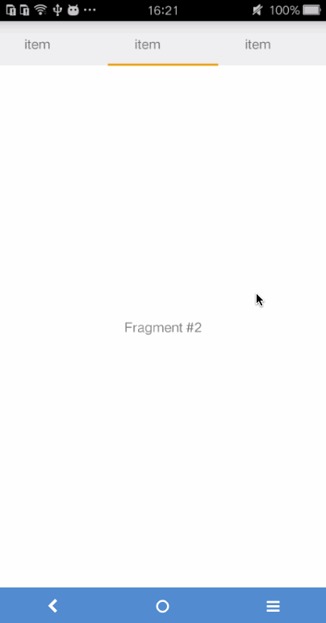

# AndroidSamples
android samples

```
compileSdkVersion 23
    buildToolsVersion "23.0.3"
    defaultConfig {
        applicationId "com.example.wuxie"
        minSdkVersion 15
        targetSdkVersion 22
        versionCode 1
        versionName "1.0"
//        testInstrumentationRunner "android.support.test.runner.AndroidJUnitRunner"
        vectorDrawables.useSupportLibrary = true
    }
```

gralde-wrapper.properties

```
distributionUrl=https\://services.gradle.org/distributions/gradle-2.10-all.zip

```

## [TablayoutDemo](./TablayoutDemo)


