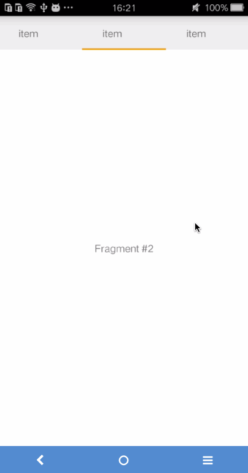

# What's the tablayout

tablayout是Support Design 包中的一个组件。
在开发中，我们常常需要ViewPager结合Fragment一起使用，如下图：



# New a layout

``` html
<?xml version="1.0" encoding="utf-8"?>
<LinearLayout xmlns:android="http://schemas.android.com/apk/res/android"
    xmlns:app="http://schemas.android.com/apk/res-auto"
    android:layout_width="match_parent"
    android:layout_height="match_parent"
    android:orientation="vertical">


    <!--app:tabMode="scrollable"  这个属性我在代码中设置了-->
   <!-- tabLayout.setTabMode(TabLayout.MODE_SCROLLABLE);-->
    <android.support.design.widget.TabLayout
        android:id="@+id/sliding_tabs"
        android:layout_width="match_parent"
        android:layout_height="wrap_content"
         />

    <android.support.v4.view.ViewPager
        android:id="@+id/viewpager"
        android:layout_width="match_parent"
        android:layout_height="0px"
        android:layout_weight="1"
        android:background="@android:color/white" />

</LinearLayout>
```

在xml添加TabLayout，如同ViewPager，直接android.support.design.widget.TabLayout即可。还有其他的属性我会在代码中设置。

# New a Fragment

```java
public class PageFragment extends Fragment {

    public static final String ARG_PAGE = "ARG_PAGE";
    private int mPage;

    public static PageFragment newInstance(int page) {
        Bundle args = new Bundle();
        args.putInt(ARG_PAGE, page);
        PageFragment pageFragment = new PageFragment();
        pageFragment.setArguments(args);
        return pageFragment;
    }

    @Override
    public void onCreate(Bundle savedInstanceState) {
        super.onCreate(savedInstanceState);
        mPage = getArguments().getInt(ARG_PAGE);
    }

    @Nullable
    @Override
    public View onCreateView(LayoutInflater inflater, ViewGroup container, Bundle savedInstanceState) {
        View view = inflater.inflate(R.layout.fragment_page, container, false);
        TextView textView = (TextView) view;
        textView.setText("Fragment #" + mPage);
        return view;
    }
}
```
其中Fragment的布局为：

```html
<TextView xmlns:android="http://schemas.android.com/apk/res/android"
    android:layout_width="match_parent"
    android:layout_height="match_parent"
    android:gravity="center" />
```
# ViewPager's Adapter

```java
public class SimpleFragmentPagerAdapter extends FragmentPagerAdapter {

    final int PAGE_COUNT = 3;
    private String tabTitles[] = new String[]{"tab1","tab2","tab3"};
    private Context context;

    public SimpleFragmentPagerAdapter(FragmentManager fm,Context context) {
        super(fm);
        this.context = context;
    }

    @Override
    public Fragment getItem(int position) {
        return PageFragment.newInstance(position + 1);
    }

    @Override
    public int getCount() {
        return PAGE_COUNT;
    }

    @Override
    public CharSequence getPageTitle(int position) {
        return tabTitles[position];
    }
}
```

# 设置TabLayout

``` java
public class ThirdActivity extends FragmentActivity {

    private SimpleFragmentPagerAdapter pagerAdapter;

    private ViewPager viewPager;

    private TabLayout tabLayout;

    @Override
    protected void onCreate(Bundle savedInstanceState) {
        super.onCreate(savedInstanceState);
        setContentView(R.layout.activity_third);
        pagerAdapter = new SimpleFragmentPagerAdapter(getSupportFragmentManager(), this);
        viewPager = (ViewPager) findViewById(R.id.viewpager);
        viewPager.setAdapter(pagerAdapter);
        tabLayout = (TabLayout) findViewById(R.id.sliding_tabs);
        tabLayout.setupWithViewPager(viewPager);
        tabLayout.setTabMode(TabLayout.MODE_FIXED);
    }
}
```

# 这里提几点我遇到的问题

```
tabLayout.setTabMode(TabLayout.MODE_FIXED);
```
tabLayout.setTabMode(TabLayout.MODE_SCROLLABLE);
运行后，三个TabLayout标签挤到一块去了。如下：


查看api，找到结果了。这个tabmode有两个属性值：
>- MODE_FIXED:Fixed tabs display all tabs concurrently and are best used with content that benefits from quick pivots between tabs.
>- MODE_SCROLLABLE:Scrollable tabs display a subset of tabs at any given moment, and can contain longer tab labels and a larger number of tabs.


不做过多的解释，MODE_SCROLLABLE适合很多tabs的情况。
> `setupWithViewPager`必须在`ViewPager.setAdapter()`之后调用

源码是这样的：

``` java
public void setupWithViewPager(ViewPager viewPager) {
    PagerAdapter adapter = viewPager.getAdapter();
    if(adapter == null) {
        throw new IllegalArgumentException("ViewPager does not have a PagerAdapter set");
    } else {
        ...
    }
}
```
以上就是最基本的用法，是不是很简单。哈~

# 自定义TabLayout样式

默认的情况下，TabLayout的tab indicator的颜色是Material Design中的accent color(#009688)，我们可以稍作修改：

```
<style name="MyCustomTabLayout" parent="Widget.Design.TabLayout">
    <item name="tabIndicatorColor">#0000FF</item>
</style>
```
然后设置style：

```
<android.support.design.widget.TabLayout
       android:id="@+id/sliding_tabs"
       style="@style/MyCustomTabLayout"
       android:layout_width="match_parent"
       android:layout_height="wrap_content"
        />
```       
或者在布局文件中设置app:tabIndicatorColor="@android:color/holo_orange_dark"

```
    <android.support.design.widget.TabLayout
        android:id="@+id/sliding_tabs"
        android:layout_width="match_parent"
        android:layout_height="wrap_content"
app:tabMode="fixed"
        app:tabIndicatorColor="@android:color/holo_orange_dark"
        />
```   
还有一些其他的样式可供选择：

```xml
<style name="MyCustomTabLayout" parent="Widget.Design.TabLayout">
    <item name="tabMaxWidth">@dimen/tab_max_width</item>
    <item name="tabIndicatorColor">?attr/colorAccent</item>
    <item name="tabIndicatorHeight">2dp</item>
    <item name="tabPaddingStart">12dp</item>
    <item name="tabPaddingEnd">12dp</item>
    <item name="tabBackground">?attr/selectableItemBackground</item>
    <item name="tabTextAppearance">@style/MyCustomTabTextAppearance</item>
    <item name="tabSelectedTextColor">?android:textColorPrimary</item>
</style>
<style name="MyCustomTabTextAppearance" parent="TextAppearance.Design.Tab">
    <item name="android:textSize">14sp</item>
    <item name="android:textColor">?android:textColorSecondary</item>
    <item name="textAllCaps">true</item>
</style>
```

# add icon to tab

当前的TabLayout没有方法让我们去添加icon，我们可以使用SpannableString结合ImageSpan来实现，在SimpleFragmentPagerAdapter中：

``` java
private int[] imageResId = {
        R.drawable.ic_one,
        R.drawable.ic_two,
        R.drawable.ic_three
};

// ...

@Override
public CharSequence getPageTitle(int position) {
    // Generate title based on item position
    // return tabTitles[position];
    Drawable image = context.getResources().getDrawable(imageResId[position]);
    image.setBounds(0, 0, image.getIntrinsicWidth(), image.getIntrinsicHeight());
    SpannableString sb = new SpannableString(" ");
    ImageSpan imageSpan = new ImageSpan(image, ImageSpan.ALIGN_BOTTOM);
    sb.setSpan(imageSpan, 0, 1, Spannable.SPAN_EXCLUSIVE_EXCLUSIVE);
    return sb;
}
```
运行，发现没有显示，这是因为TabLayout创建的tab默认设置textAllCaps属性为true，这阻止了ImageSpan被渲染出来，可以通过下面的样式文件定义来改变：

```xml
<style name="MyCustomTabLayout" parent="Widget.Design.TabLayout">
      <item name="tabTextAppearance">@style/MyCustomTextAppearance</item>
</style>

<style name="MyCustomTextAppearance" parent="TextAppearance.Design.Tab">
      <item name="textAllCaps">false</item>
</style>
```
现在运行，效果就出来了。

# add icon and text to tab

```java
@Override
public CharSequence getPageTitle(int position) {
    // Generate title based on item position
    Drawable image = context.getResources().getDrawable(imageResId[position]);
    image.setBounds(0, 0, image.getIntrinsicWidth(), image.getIntrinsicHeight());
    
    // Replace blank spaces with image icon
    SpannableString sb = new SpannableString("   " + tabTitles[position]);
    ImageSpan imageSpan = new ImageSpan(image, ImageSpan.ALIGN_BOTTOM);
    sb.setSpan(imageSpan, 0, 1, Spannable.SPAN_EXCLUSIVE_EXCLUSIVE);
    return sb;
}
```
我们看到在实例化SpannableString的时候，我在tabTitles[position]前面加了几个空格，这些空格的位置是用来放置icon的。

# 添加自定义的view到tab

适配器中增加getTabView(...)方法：

```java
public class SimpleFragmentPagerAdapter extends FragmentPagerAdapter {

    final int PAGE_COUNT = 3;
    private String tabTitles[] = new String[]{"tab1", "tab2", "tab3"};
    private int[] imageResId = {R.drawable.avatar_enterprise_vip,
            R.drawable.avatar_grassroot,
            R.drawable.avatar_vip};
    private Context context;

    public SimpleFragmentPagerAdapter(FragmentManager fm, Context context) {
        super(fm);
        this.context = context;
    }

    @Override
    public Fragment getItem(int position) {
        return PageFragment.newInstance(position + 1);
    }

    @Override
    public int getCount() {
        return PAGE_COUNT;
    }

    @Override
    public CharSequence getPageTitle(int position) {
        //第一次的代码
        //return tabTitles[position];
        //第二次的代码
       /**
         Drawable image = context.getResources().getDrawable(imageResId[position]);
        image.setBounds(0, 0, image.getIntrinsicWidth(), image.getIntrinsicHeight());
        SpannableString sb = new SpannableString(" " + tabTitles[position]);
        ImageSpan imageSpan = new ImageSpan(image, ImageSpan.ALIGN_BOTTOM);
        sb.setSpan(imageSpan, 0, 1, Spanned.SPAN_EXCLUSIVE_EXCLUSIVE);
        return sb;*/


        return null;
    }
    public View getTabView(int position){
        View view = LayoutInflater.from(context).inflate(R.layout.tab_item, null);
        TextView tv= (TextView) view.findViewById(R.id.textView);
        tv.setText(tabTitles[position]);
        ImageView img = (ImageView) view.findViewById(R.id.imageView);
        img.setImageResource(imageResId[position]);
        return view;
    }
}
```
简单的布局：

```xml
<RelativeLayout xmlns:android="http://schemas.android.com/apk/res/android"
    android:layout_width="wrap_content"
    android:layout_height="wrap_content"
    >

    <ImageView
        android:layout_width="wrap_content"
        android:layout_height="wrap_content"
        android:id="@+id/imageView"
        android:layout_centerVertical="true"
        />

    <TextView
        android:layout_width="wrap_content"
        android:layout_height="wrap_content"
        android:layout_toRightOf="@id/imageView"
        android:layout_centerVertical="true"
        android:id="@+id/textView"
        android:layout_marginLeft="3dp"
        />

</RelativeLayout>
```

```java
@Override
protected void onCreate(Bundle savedInstanceState) {
       super.onCreate(savedInstanceState);
       setContentView(R.layout.activity_third);
       pagerAdapter = new SimpleFragmentPagerAdapter(getSupportFragmentManager(), this);
       viewPager = (ViewPager) findViewById(R.id.viewpager);
       viewPager.setAdapter(pagerAdapter);
       tabLayout = (TabLayout) findViewById(R.id.sliding_tabs);
       tabLayout.setupWithViewPager(viewPager);
       tabLayout.setTabMode(TabLayout.MODE_FIXED);
       for (int i = 0; i < tabLayout.getTabCount(); i++) {
           TabLayout.Tab tab = tabLayout.getTabAt(i);
           tab.setCustomView(pagerAdapter.getTabView(i));
       }
   }
```

# 处理配置改变
当屏幕旋转或者配置改变的时候，我们需要保存当前的状态。

```java
@Override
   public void onSaveInstanceState(Bundle outState) {
       super.onSaveInstanceState(outState);
       outState.putInt(POSITION,tabLayout.getSelectedTabPosition());
   }

   @Override
   protected void onRestoreInstanceState(Bundle savedInstanceState) {
       super.onRestoreInstanceState(savedInstanceState);
       viewPager.setCurrentItem(savedInstanceState.getInt(POSITION));
}
```

**需要注意的是getSelectedTabPosition()方法是最新的design support library才有的。**

最后效果

